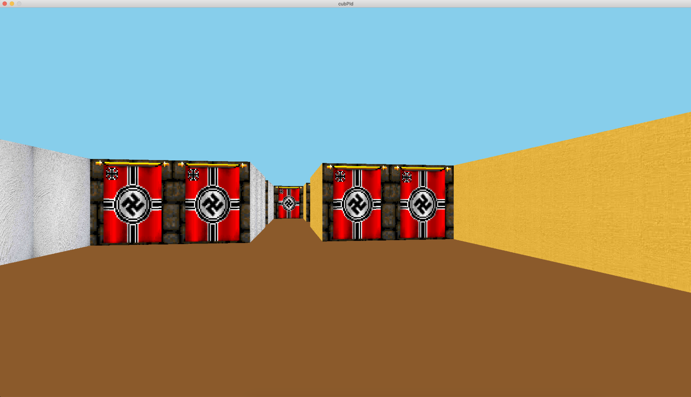
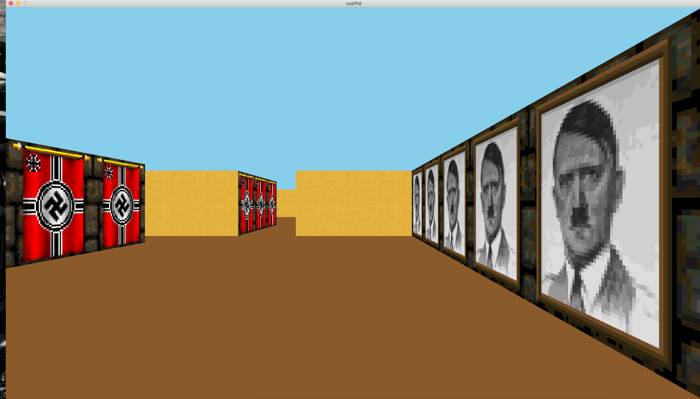

# raycaster-game-vec2-trigonemtry 

In the mandatory part, a raycaster is implemented using pure vector relations. The bonus part utilizes trigonometry for implementation.

## Steps

1. **Camera Plane Setup:**
   - Begin by creating a camera plane.
   - Generate rays based on the window size. I made this [link](https://www.geogebra.org/m/hacejpdv) for visualization.

2. **Ray Generation and Collision Detection:**
   - Generate vectors for each ray.
   - Use the DDA (Digital Differential Analyzer) algorithm to check collisions with walls.

3. **Distance Calculation:**
   - Find the position of the wall upon collision.
   - Calculate the distance using a modified version of the DDA algorithm.
   - To avoid fisheye effects, use the distance to the camera plane for calculations.

   

   Using mathematical relations:
   ```
   (mapY - posY + (1 - stepY) / 2) / raydirY = perpWallDist
   ```

4. **Wall Height Calculation:**
   - Calculate the height of the wall to create the illusion of depth.
   - Utilize the concept of raycasting where distant walls appear shorter.
   - Adjust the wall height using the inverse of the distance and the height of the window.

   Example adjustment:
   ```
   2 * windowHeight / perpWallDist
   ```

## Resources

- [Lode's Computer Graphics Tutorial - Raycasting](https://lodev.org/cgtutor/raycasting.html#Textured_Raycaster)
- [Video Tutorial by javidx9](https://youtu.be/NbSee-XM7WA?si=sakiJoIp4JPn1EAO)
- [Video Tutorial by Bisqwit](https://youtu.be/DFZnzCbmlng?si=VJls_dOO_ILik_ib)

### In-Game Screenshots






